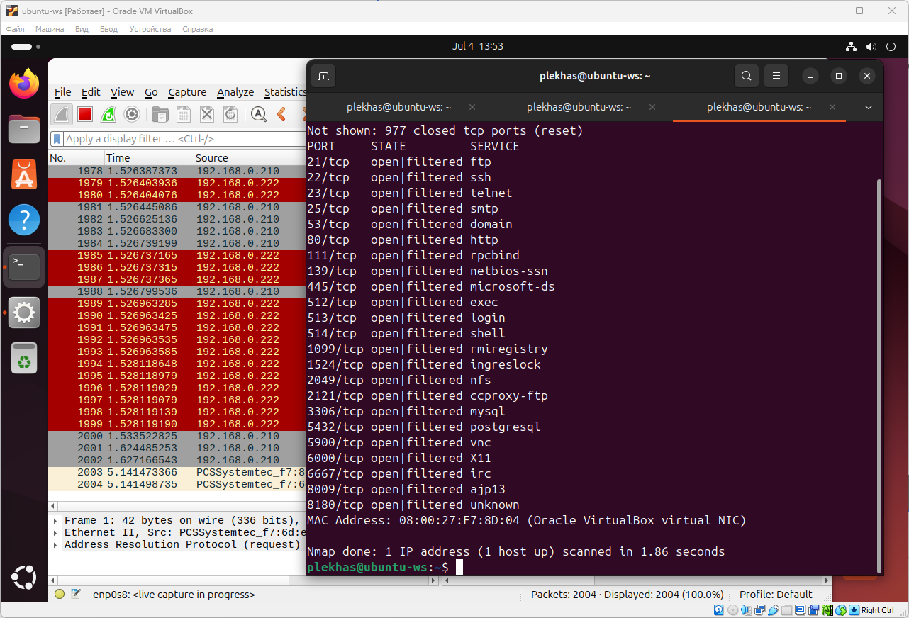

# Домашнее задание к занятию «Уязвимости и атаки на информационные системы» - Плеханов С.А.

### Задание 1

Скачайте и установите виртуальную машину Metasploitable: https://sourceforge.net/projects/metasploitable/.

Это типовая ОС для экспериментов в области информационной безопасности, с которой следует начать при анализе уязвимостей.

Просканируйте эту виртуальную машину, используя **nmap**.

Попробуйте найти уязвимости, которым подвержена эта виртуальная машина.

Сами уязвимости можно поискать на сайте https://www.exploit-db.com/.

Для этого нужно в поиске ввести название сетевой службы, обнаруженной на атакуемой машине, и выбрать подходящие по версии уязвимости.

Ответьте на следующие вопросы:

- Какие сетевые службы в ней разрешены?
- Какие уязвимости были вами обнаружены? (список со ссылками: достаточно трёх уязвимостей)
  
*Приведите ответ в свободной форме.*

### Решение 1  

На исследуемой машине разрешены следующие сетевые службы:

Для указанных сетевых служб характерны следующие уязвимоости в качестве примера:

[ZeroShell 3.9.0 - Remote Command Execution](https://www.exploit-db.com/exploits/49862)

[uftpd 2.10 - Directory Traversal (Authenticated)](https://www.exploit-db.com/exploits/51000)

[MySQL User-Defined (Linux) x32 / x86\_64 - 'sys\_exec' Local Privilege Escalation (2)](https://www.exploit-db.com/exploits/50236)

### Задание 2

Проведите сканирование Metasploitable в режимах SYN, FIN, Xmas, UDP.

Запишите сеансы сканирования в Wireshark.

Ответьте на следующие вопросы:

- Чем отличаются эти режимы сканирования с точки зрения сетевого трафика?
- Как отвечает сервер?

*Приведите ответ в свободной форме.*

### Решение 2

В режиме SYN получилось просканировать все порты и определить открытые за 0.51 секунду.

В режиме FIN получилось просканировать все порты и определить открытые за 0.40 секунд, но при этом открытые порты определены не были.

В режиме SYN получилось просканировать все порты и определить открытые за 1.86 секунды, хотя размер запросов и ответов примерноо одинаков и при этом количество перехваченных пакетов также примерно одинаково.

В режиме UDP сканирование происходит непрерывно и завеершения процесса не наступает, хотя Wireshark показывает постоянное прохождение запросов-ответов через наблюдаемый интерфейс.

